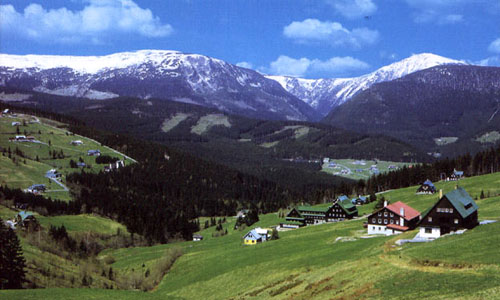
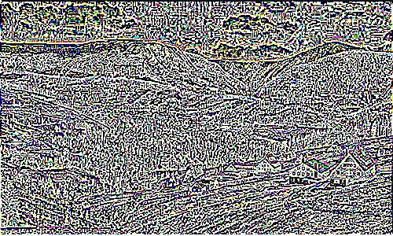

# Not finished yet.
## features:
- [x] Layers
- [x] Convolution filters
- [ ] Painting
- [ ] Reordering layers
- [ ] Event system
## Convolution example
### Code
```javascript
cnv.layer(0).convolution([ // Laplacian of gaussian filter
[0,0,1,0,0],
[0,1,2,1,0],
[1,2,-16,2,1],
[0,1,2,1,0],
[0,0,1,0,0],
]).invert()
```
### Entry

### Result

